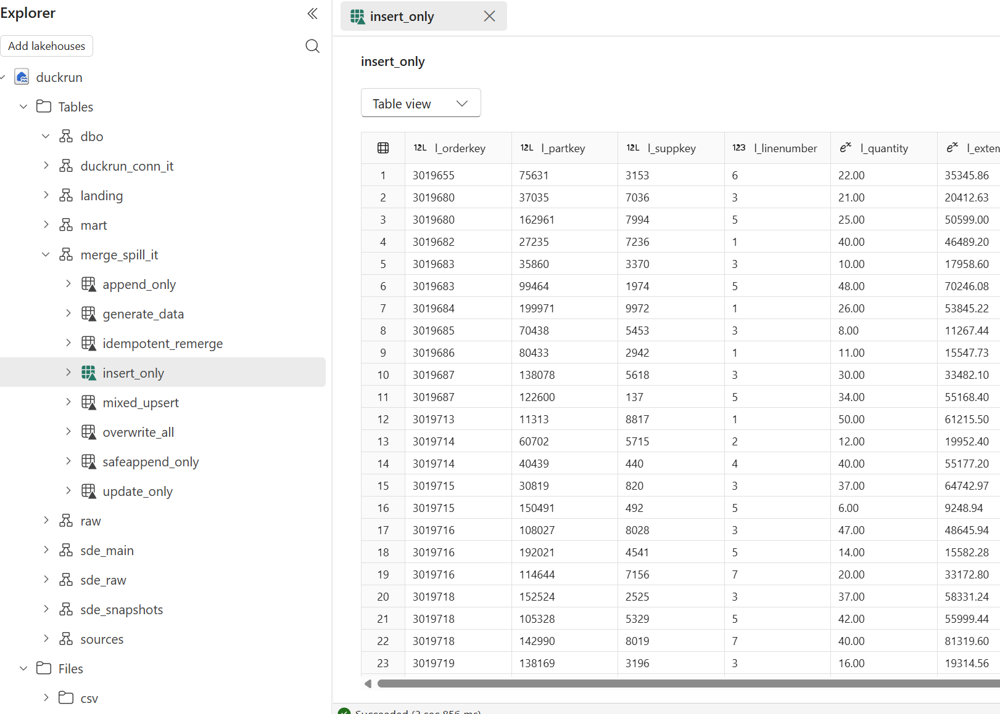

# Examples { .duck-hide }

Real dbt projects materialized as Delta tables, plus runnable connection-API showcases —
every one rebuilt against live Microsoft Fabric OneLake on each push to `main`.

*The DAGs below, materialized — duckrun writes each dbt model as a Delta table, here in a
Microsoft Fabric OneLake lakehouse.*

## dbt projects

-   __[makeopendata](https://github.com/djouallah/duckrun/tree/main/tests/integration_tests/makeopendata)__

    The [make-open-data](https://github.com/make-open-data/make-open-data) project ported off
    Postgres + PostGIS: ~30 models over real French open data (INSEE census, Etalab/La Poste
    geography, DVF real-estate, IGN communes + IRIS contours), with the spatial SQL rewritten for
    DuckDB's `spatial` extension and every geometry materialized as a Delta table (WKB).

    *source: [make-open-data/make-open-data](https://github.com/make-open-data/make-open-data)*

-   __[aemo](https://djouallah.github.io/dbt_fabric_python_delta/#!/model/model.aemo_electricity.fct_scada)__

    The AEMO dbt project built against live Microsoft Fabric OneLake (`abfss://`). Full
    catalog with column metadata over the real Delta tables.

    *source: [djouallah/dbt_fabric_python_delta](https://github.com/djouallah/dbt_fabric_python_delta)*

-   __[coffee](coffee.html)__

    The coffee-shop scenario (`coffee_shop`): ingest two dimension CSVs over https, dedup
    the SCD2 product dim, generate an N-row fact partitioned by region, and a revenue mart.
    Built for real on OneLake, so the catalog carries Delta stats.

    *source: [JosueBogran/coffeeshopdatageneratorv2](https://github.com/JosueBogran/coffeeshopdatageneratorv2)*

-   __[sde_dbt_tutorial](sde_dbt_tutorial.html)__

    The `josephmachado/simple_dbt_project` port: raw tables → bronze typing → a
    Delta-backed SCD2 snapshot of the customer dim → a merge-incremental clickstream fact →
    the `orders_obt` gold mart joined through the SCD2 validity window.

    *source: [josephmachado/simple_dbt_project](https://github.com/josephmachado/simple_dbt_project)*

## Pure SQL — the connection API

These are *not* dbt projects — they're runnable showcases of `duckrun.connect()`. Click
through for every statement and its actual output from a live run.

-   __[taxi — live NYC Yellow-Taxi → Delta](taxi.html)__

    Reads **live** NYC TLC Yellow-Taxi data straight off `https` and lands it into Delta on
    OneLake using nothing but `conn.sql(...)` — QUALIFY, PIVOT, ROLLUP, ASOF JOIN, a
    SQL-only upsert, time travel, and a concurrent-MERGE clash.

    *source: [demo_taxi.py](https://github.com/djouallah/duckrun/blob/main/tests/integration_tests/taxi/demo_taxi.py)*

-   __[multi-catalog — lakehouse + warehouse + local](multicatalog.html)__

    One `duckrun.connect()` session binding three catalogs: a **writable** OneLake
    lakehouse, a **read-only** Fabric Warehouse (`attach(..., read_only=True)`), and a local
    scratch dir. A single `conn.sql` JOINs across them as `catalog.schema.table`, the
    read-only fence refuses a warehouse write, and the mart is written back to the lakehouse.

    *source: [demo_multicatalog.py](https://github.com/djouallah/duckrun/blob/main/tests/integration_tests/multicatalog/demo_multicatalog.py)*

