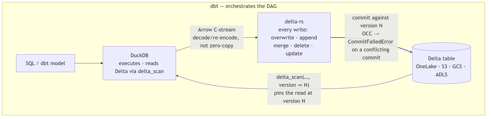
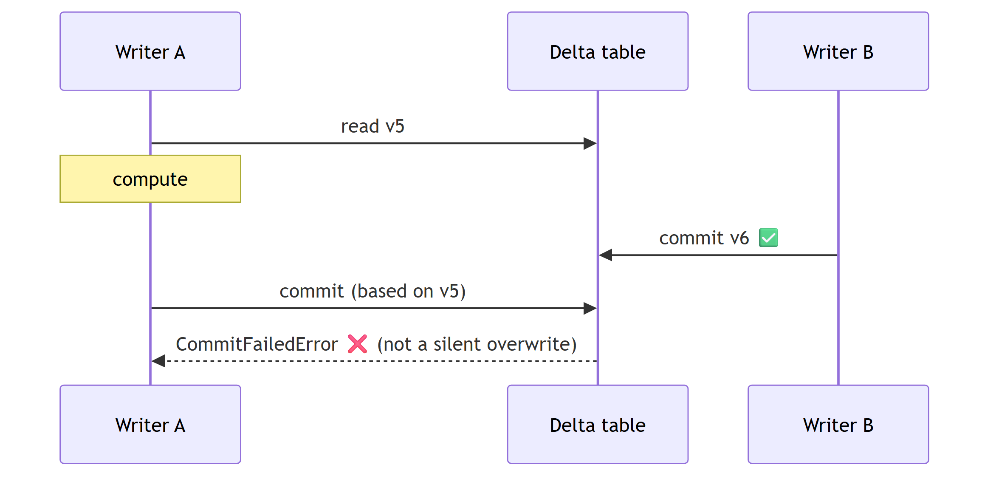

# Overview

duckrun is **glue over DuckDB + delta-rs + dbt-duckdb**. It gives you two surfaces over
the same engine split: a notebook `connect()` helper for ad-hoc SQL over Delta, and a dbt
adapter that materializes models as Delta tables. Concurrent writers are first-class —
every write is snapshot-pinned and fails loud rather than silently interleaving.

## How it works

Two engines, split cleanly: DuckDB runs every query and reads Delta through `delta_scan`
views, delta-rs handles every write, an Arrow C-stream bridges them, and dbt orchestrates
on top.

Writes are **snapshot-pinned**: the read is fixed at `delta_scan(…, version => N)` and the
write commits against `N`, so a concurrent commit is rejected with `CommitFailedError`
instead of silently overwriting a lost update.

The full model — and how it compares to delta-rs, Spark/Delta, and an RDBMS — is in
[Snapshot isolation](snapshot-isolation.md). The engine-split rationale is in the
[Design document](design_document.md).

## Why duckrun

-   __Snapshot-pinned writes__

    Every read-modify-write is fenced to the version it read. A concurrent commit is
    rejected with `CommitFailedError` instead of silently overwriting a lost update.

-   __Two engines, split cleanly__

    DuckDB runs every query and reads Delta via `delta_scan`; delta-rs handles every
    write; an Arrow C-stream bridges them.

-   __A real dbt adapter__

    A thin wrapper around `dbt-duckdb` that adds Delta-backed `table` / `incremental`
    materializations — everything else is inherited.

-   __Multiple catalogs__

    Attach more lakehouses (or a read-only Fabric Warehouse) and read / join across them
    by three-part `catalog.schema.table` name.

-   __Automatic maintenance__

    Compaction, vacuum, and log cleanup run inline on every write — no `OPTIMIZE` /
    `VACUUM` job to schedule.

-   __SQL-first DML__

    `conn.sql` applies `insert` / `update` / `delete` / `merge` through delta-rs —
    identical locally and on OneLake.

