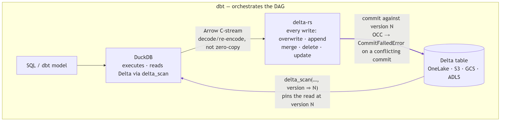
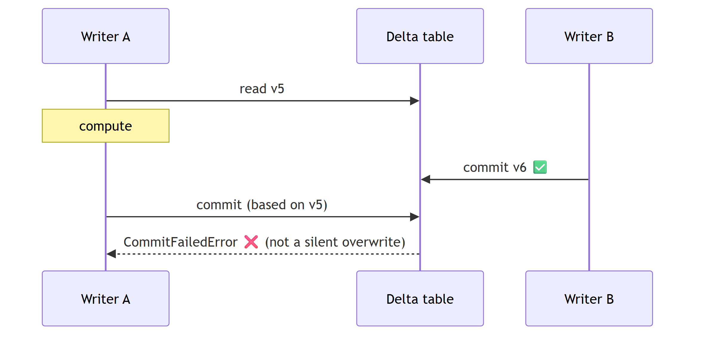

# Overview

duckrun is **glue over DuckDB + delta-rs + dbt-duckdb**: a notebook `connect()` for SQL over Delta,
and a dbt adapter that materializes models as Delta tables, on one engine split.

## How it works

DuckDB runs every query and reads Delta through `delta_scan` views; delta-rs handles every write;
an Arrow C-stream bridges them; dbt orchestrates on top.

Writes are **snapshot-pinned**: the read is fixed at `delta_scan(…, version => N)` and the write
commits against `N`, so a concurrent commit is rejected with `CommitFailedError` instead of silently
overwriting a lost update.

The full model is in [Snapshot isolation](snapshot-isolation.md); the engine-split rationale in the
[Design document](design_document.md).
