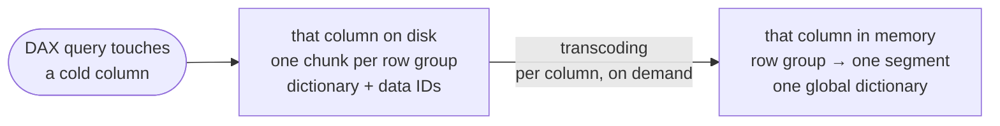

# Parquet layout

duckrun tries to write **VertiPaq-friendly Parquet**. Three properties define every table it lands:

- **6M-row row groups** — one Parquet row group becomes one VertiPaq column segment.
- **Dictionary encoding** — kept wherever sensible, and declared in the footer, so the transcode is a remap.
- **Sorted** — duckrun has no V-Order; it approximates its effect with a single global `ORDER BY` over the table.

## Direct Lake transcodes, it doesn't scan

VertiPaq is Power BI's in-memory engine; Direct Lake is the storage mode where that engine reads Parquet straight from OneLake. It does not scan the file per query the way DuckDB or Spark do. The first DAX query to touch a column **transcodes** that column, once: the per-row-group Parquet dictionaries are merged into one VertiPaq dictionary, and each row group is loaded as one resident column segment. Columns no query touches are never read, and a warm query on resident columns never touches the file again until a reframe brings new data or memory pressure evicts segments.



Dictionary encoding is what makes the transcode cheap: a dictionary-encoded chunk is an ID remap, a PLAIN chunk is re-encoded from raw values. The fast path is gated on the footer, not the pages — `ColumnMetaData.encoding_stats` has to declare the chunk 100% dictionary-encoded, or the engine decodes and re-hashes every value. Same 142M-row string column, same pages: 10.9 s cold without the field, 0.7 s with it. duckrun's writer (delta-rs) emits it; DuckDB's `COPY TO parquet` did not until [duckdb#24957](https://github.com/duckdb/duckdb/pull/24957).

The layout is mainly for the **cold** load, the cost a report user feels on first click, which scales with the row-group count twice (dictionary merge, then segment setup). Hot scans inherit the row order and the segment count, so the sort and the row-group size keep paying. Measurements are in [direct-lake-parquet-layout](https://github.com/djouallah/direct-lake-parquet-layout).

## Write settings

| Property | Value | Why |
| --- | --- | --- |
| Compression | `SNAPPY` | The transcode is decode-bound. SNAPPY output is ~1.3× ZSTD on representative data; the sort and the dictionary do most of the shrinking. |
| Row group | ≤ 6M rows, fixed | One row group becomes one segment. 1–16M rows is a healthy segment; 2–6M measured best in the sweeps (hot leans to ~2M), 16M is the ceiling, and DuckDB's 122,880-row default made the same table 3.5× slower cold. This is a ceiling, not a size: the 256 MB file roll usually closes the group first. |
| Dictionary page | 32 MB | Mid- and high-cardinality columns stay dictionary-encoded; truly unique columns overflow to PLAIN, which is correct. It is also the main lever on merge memory, since a merge reading the table materializes the dictionaries: on an 18M-row merge, 128 MB peaked at ~25 GB, 16 MB at ~8.7 GB. |
| Data page | 1 MB, 1M-row cap | The row cap matters: without it a highly compressible column buffers the whole row group as one page ([arrow-rs #5797](https://github.com/apache/arrow-rs/issues/5797)). |
| Statistics | chunk-level, 64-char truncation | Row-group min/max is what a reader skips on; page statistics only bloat the footer. |
| Target file | 256 MB | A row group cannot span files, so every file's last group is cut wherever the roll lands. 128 MB doubled the file count and the truncated tails (4 of 25 groups vs ~2 on the 142M-row reference mart), so 256 stays. |

- **Every write uses this profile** — overwrite, append, `replaceWhere` (microbatch), `SORTED BY AUTO`, and post-write compaction. **`MERGE` is the one exception**: it writes with delta-rs defaults so it never rewrites large files or materializes large dictionaries to touch a few rows, and the threshold-gated compaction folds its files back into the layout later. An insert-only merge is routed to a DuckDB anti-join and a plain append, so it does get the profile.
- **Reader first, merge survives.** Each value is the largest that still passes the merge spill tests: Direct Lake wants big groups, big files and retained dictionaries; delta-rs buffers a whole uncompressed row group per open writer and pays for every dictionary it reads.
- **Per-model overrides.** `max_row_group_size` (rows) and `target_file_size_mb` pin a model's geometry; the explicit value is honored verbatim and preserved by post-write compaction. See the [config reference](dbt-adapter.md#config-options-table-incremental-delta).
- **How the numbers are grounded.** The engine is treated as a black box. The same ~140M-row fact is built twice, with Spark's V-Order writer and with duckrun, both deployed as Direct Lake semantic models, and heavy DAX queries are timed over XMLA cold and hot. A writer property is kept only if the DAX time moves toward the V-Order reference and the merge spill tests still pass. That is one dataset, so treat the values as defaults, not guarantees; the comparison is reproducible from `tests/parquet_layout/aemo/` and the manual `parquet_layout.yml` workflow.

## Automatic sorting

```sql
-- profile the table, pick the key, rewrite sorted by it
CREATE OR REPLACE TABLE sales SORTED BY AUTO AS SELECT * FROM sales;

-- or name the key yourself (DuckDB's own CTAS syntax)
CREATE OR REPLACE TABLE sales SORTED BY (region, order_date) AS SELECT * FROM sales;

-- compact small files, no re-sort
VACUUM sales;
```

Both `SORTED BY` forms do the same thing: one global `ORDER BY` over the whole table, streamed back out as new files in the layout above, in one new Delta version. It is not a per-file or per-row-group sort and not z-order. Because the order is global, a run of equal values continues across row-group boundaries and each group's min/max range is disjoint from its neighbours', which is what lets a reader skip groups; a sort restarted per row group gives neither. The only decision `AUTO` makes is which columns go in that `ORDER BY`, and in what order.

A sort shrinks a file by manufacturing runs. In arrival order a column breaks into `E[runs] ≈ N·(1 − Σ p_v²)` runs (the Simpson index of its value histogram): a near-uniform column shatters and falls back to bit-packed dictionary indices, a sorted one collapses into run-length encoding with a compact dictionary. How much that helps is a property of your data's cardinality and skew, so the same key can halve one table and do nothing to another.

From dbt the picker is the model config `sort_by: auto` (the scalar; a list form raises). It profiles the staged result of every run, so the key can differ between incremental batches, and writes unsorted when nothing pays off. It is inert on the delta-rs `merge`, `microbatch` and `delete+insert` paths, which keep the table's existing layout. A trailing `ORDER BY` in the model SQL is not honored; `sort_by` is.

### How the picker chooses

A greedy single pass over a profile of the table (cardinality, skew, null density, functional dependencies):

- **The coarsest date leads.** One temporal column takes the first slot; a near-unique timestamp is not allowed to, since it would spend the whole key on a row id.
- **Then ascending cardinality**, coarse to fine, up to 4 dimension columns.
- **Partition columns go outermost** but take no slot: Delta strips them from the data files.
- **Functionally dependent columns are skipped.** If `distinct(X) == distinct(X, c)` the prefix already clusters `c` (`year` behind `date`). Cardinalities are HyperLogLog sketches; a candidate near the prefix's grain is confirmed with one exact count, because a sketch's error at 10³–10⁵ distinct values is larger than the tolerance the test needs.
- **Stop at the grain.** Once the prefix nearly identifies rows there are no runs left to make.
- **Mostly-null columns are never candidates**; unique and near-unique columns are written PLAIN.
- **Measures never hold a dimension slot.** A `DECIMAL` / `FLOAT` / `DOUBLE` column can only take one of up to 4 tail slots below the whole dimension key, where it reorders rows inside a dimension group, and only if it pays for itself in both its own modelled bytes and the table's. On this path a `DECIMAL(p > 18)` whose values fit is narrowed to `DECIMAL(18, s)` so it regains dictionary encoding.

**Determinism and cost.** The profile is a deterministic function of the data: no sample, no seed. Up to 30M rows every row is read; above that the picker profiles a hash-selected substrate (`WHERE hash(row) % K = 0`, about 30M rows) and scales the counts back up. `DUCKRUN_PROFILE_ROWS` moves the cap; `0` profiles every row always. The source is staged once into a local temp table that every pass scans, so a full local copy (or the substrate) exists for the duration of the write; it spills to DuckDB's `temp_directory`, so disk is the ceiling. `SORTED BY (cols)` skips profiling entirely.

**It can do nothing.** A near-uniform table has no runs to make, and a table already organized by a unique key has nothing left to cluster; there `SORTED BY AUTO` degrades to a plain compaction. The picker optimizes a model of the on-disk size, so compare `conn.get_stats("sales")` before and after.

## Why a heuristic

The provably best key is out of reach: the candidates are ordered subsets of the columns (past a million by ten columns), and the only faithful way to score one is to sort and write the whole table that way. Lemire, Kaser and Aouiche showed that a plain lexicographic sort with low-cardinality columns first captures most of the available win, up to ~9× on their bitmap indexes, with the column order alone worth ~40% ([*Sorting improves word-aligned bitmap indexes*, 2010](https://arxiv.org/abs/0901.3751)). The picker is that recommendation plus what one profiling pass can add. When you know the table's grain and query patterns, `SORTED BY (cols)` will often beat `AUTO`; treat `AUTO` as the default for tables you have not studied, and verify with `get_stats`.
